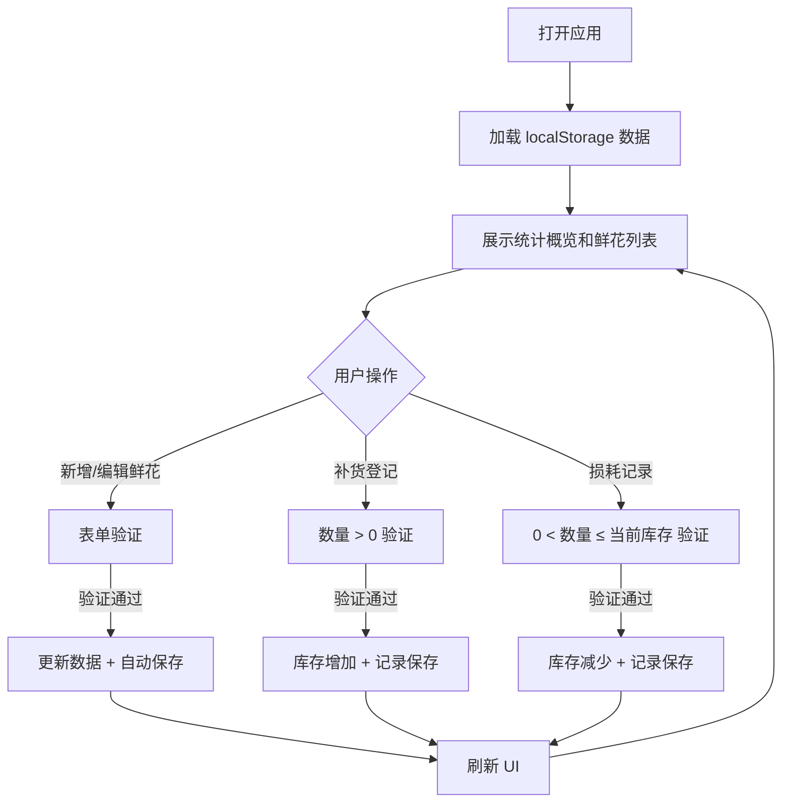

## 1. 产品概述

鲜花冷柜库存面板是为殡葬服务机构设计的库存管理系统，用于维护鲜花冷柜的库存信息、补货记录和损耗状态。系统采用纯前端架构，数据持久化存储在浏览器 localStorage 中，无需后端服务支持。

## 2. 核心功能

### 2.1 用户角色

| 角色 | 注册方式 | 核心权限 |
|------|----------|----------|
| 管理员 | 无需注册，本地使用 | 所有功能的完整访问权限 |

### 2.2 功能模块

1. **统计概览面板**：库存状态统计、补货/损耗趋势、库存预警
2. **鲜花列表管理**：鲜花信息展示、筛选、搜索、状态标识
3. **鲜花编辑**：新增、编辑鲜花信息，表单验证
4. **补货登记**：记录鲜花补货操作，库存自动更新
5. **损耗记录**：记录鲜花损耗操作，库存自动扣减
6. **详情抽屉**：查看鲜花详细信息和操作记录

### 2.3 页面详情

| 页面名称 | 模块名称 | 功能描述 |
|----------|----------|----------|
| 主面板 | 统计概览 | 展示库存总数、状态分布、近期补货/损耗图表 |
| 主面板 | 鲜花列表 | 表格展示所有鲜花，支持搜索筛选、状态标红 |
| 主面板 | 操作工具栏 | 新增鲜花、补货登记、损耗记录按钮 |
| 详情抽屉 | 鲜花信息 | 展示鲜花完整信息和操作历史 |
| 详情抽屉 | 记录列表 | 展示该鲜花的所有补货和损耗记录 |

## 3. 核心流程

用户打开应用 → 加载 localStorage 数据 → 查看库存概览和鲜花列表 → 执行新增/编辑/补货/损耗操作 → 数据自动保存到 localStorage → 刷新页面数据不丢失

## 4. 用户界面设计

### 4.1 设计风格

- **主色调**：深绿色系（#065f46），象征生命与敬意
- **辅助色**：暖金色（#d97706）用于操作按钮，红色（#dc2626）用于库存预警
- **中性色**：深灰背景搭配白色卡片，营造专业、肃穆的氛围
- **按钮风格**：圆角中等，悬停有轻微阴影和缩放效果
- **字体**：使用系统无衬线字体，保持清晰易读
- **布局风格**：卡片式布局，顶部导航 + 左侧统计 + 右侧主内容区
- **图标风格**：线性图标，简洁专业

### 4.2 页面设计概述

| 页面名称 | 模块名称 | UI 元素 |
|----------|----------|----------|
| 主面板 | 统计概览 | 数据卡片、环形图、柱状图、渐变背景 |
| 主面板 | 鲜花列表 | 数据表格、状态标签、搜索框、筛选下拉 |
| 详情抽屉 | 鲜花信息 | 信息卡片、操作按钮、时间线记录 |
| 弹窗表单 | 编辑表单 | 输入框、下拉选择、日期选择、表单验证提示 |

### 4.3 响应式

- 桌面端优先设计，适配 1280px 及以上分辨率
- 平板端自动调整布局，统计卡片换行显示
- 移动端优化表格显示，支持横向滚动
