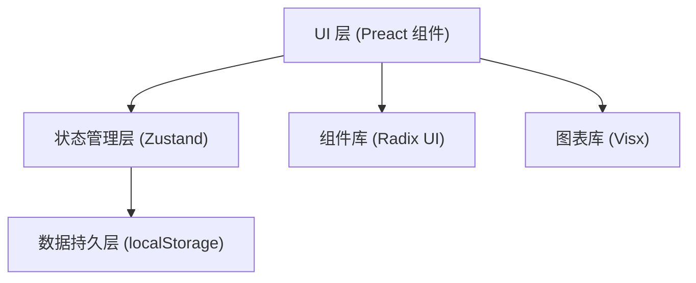
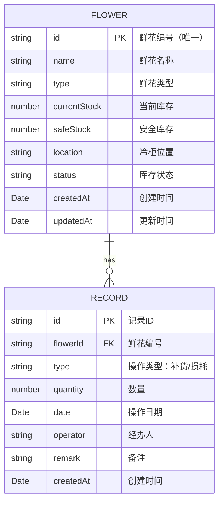

## 1. 架构设计



## 2. 技术描述

- **前端框架**：Preact@10 + TypeScript@5
- **构建工具**：Vite@5
- **样式方案**：TailwindCSS@3
- **状态管理**：Zustand@4
- **UI 组件**：Radix UI (Dialog, Drawer, Select, DropdownMenu 等)
- **图表库**：@visx/shape, @visx/scale, @visx/axis, @visx/group, @visx/legend
- **图标库**：lucide-preact
- **数据存储**：浏览器 localStorage
- **初始化工具**：Vite

## 3. 目录结构

```
src/
├── components/          # 组件目录
│   ├── ui/             # Radix UI 封装组件
│   │   ├── Button.tsx
│   │   ├── Dialog.tsx
│   │   ├── Drawer.tsx
│   │   ├── Input.tsx
│   │   ├── Select.tsx
│   │   └── Table.tsx
│   ├── FlowerForm.tsx   # 鲜花表单
│   ├── FlowerList.tsx   # 鲜花列表
│   ├── RecordForm.tsx   # 操作记录表单
│   ├── StatCard.tsx     # 统计卡片
│   └── Charts.tsx       # 图表组件
├── hooks/               # 自定义 hooks
│   └── useLocalStorage.ts
├── store/               # 状态管理
│   └── useFlowerStore.ts
├── types/               # 类型定义
│   └── index.ts
├── utils/               # 工具函数
│   ├── constants.ts
│   └── helpers.ts
├── App.tsx              # 主应用组件
├── main.tsx             # 入口文件
└── index.css            # 全局样式
```

## 4. 数据模型

### 4.1 数据模型定义



### 4.2 TypeScript 类型定义

```typescript
export type FlowerStatus = '正常' | '偏低' | '缺货' | '停用';
export type RecordType = '补货' | '损耗';

export interface Flower {
  id: string;
  name: string;
  type: string;
  currentStock: number;
  safeStock: number;
  location: string;
  status: FlowerStatus;
  createdAt: string;
  updatedAt: string;
}

export interface Record {
  id: string;
  flowerId: string;
  type: RecordType;
  quantity: number;
  date: string;
  operator: string;
  remark: string;
  createdAt: string;
}

export interface FlowerStore {
  flowers: Flower[];
  records: Record[];
  addFlower: (flower: Omit<Flower, 'id' | 'createdAt' | 'updatedAt' | 'status'>) => void;
  updateFlower: (id: string, flower: Partial<Flower>) => void;
  deleteFlower: (id: string) => void;
  addRecord: (record: Omit<Record, 'id' | 'createdAt'>) => void;
  calculateStatus: (currentStock: number, safeStock: number) => FlowerStatus;
}
```

## 5. 核心功能实现说明

### 5.1 数据持久化

使用 Zustand + localStorage 中间件实现数据自动持久化：

```typescript
import { create } from 'zustand';
import { persist } from 'zustand/middleware';

export const useFlowerStore = create(
  persist(
    (set, get) => ({ /* ... */ }),
    { name: 'flower-inventory-storage' }
  )
);
```

### 5.2 库存状态自动计算

```typescript
const calculateStatus = (currentStock: number, safeStock: number): FlowerStatus => {
  if (currentStock === 0) return '缺货';
  if (currentStock < safeStock) return '偏低';
  return '正常';
};
```

### 5.3 表单验证规则

- 鲜花编号：非空 + 唯一性校验
- 鲜花名称：必填
- 数量：必须 > 0
- 损耗数量：必须 ≤ 当前库存

### 5.4 初始化数据

应用首次加载时，自动生成 5-8 条示例鲜花数据和若干操作记录，便于演示使用。
